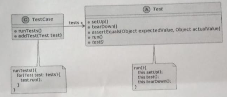

---

##### 1. Indique, para cada uno de los siguientes items, si es parte de algún hotspot o si no corresponde a ninguno de los dos.

- ##### a. El framework se asegura de que la preparación y el desarmado se efectúan antes y después de cada test.
    - Frozen spot 
    - Esta es una parte invariable del framework, los metodos 'setUp()' y 'tearDown()' siempre se van a ejecutar el el orden correcto.

- ##### b. Al definir una prueba, el programador determina cómo hacer la preparación (si es necesaria).
    - Hotspot 
    - Podemos hacer una implementación específica del metodo 'setUp()', que puede variar para cada prueba.

- ##### c. La clase Test es abstracta.
    - Podria coinsiderarse Hotspot ya que esto requiere que el usuario del framework implemente en las Sublcases implemente la logica del método test().
    - Tambien puede ser visto solo como una característica del diseño del framework.
    - Yo diria que mas bien un hotspot seria que: 
    el programador define el comportamiento y el orden de los tests ( esto gracias al metodo abtracto test() )
    y que el que la clase Test sea abtracta es mas una caracteristica del diseño estructural del framework

- ##### d. Al correr un caso de prueba se corren todas las pruebas incluidas en el caso.
    - Frozen spot, la logica para probar los tests, ubicada en el metodo runTests(), esta definida por el framework y no puede ser alterada, en un caso de prueba siempre debo recorrer todos los tests, si quisiera solo verificar algunos o uno solo no seria posible.

- ##### e. Al definir una prueba el programador define los pasos de la prueba (usando los asserts que provee el framework).
    - Hot spot, los pasos específicos de la prueba y cómo se utilizan los asserts es un hotspot, ya que permite al usuario del framework especificar la lógica de verificación dentro del método test() que deben implementar.

---

##### 2. ¿Observa métodos gancho? ¿Cuáles?

- Los métodos gancho serian:
- setUp(): El método que puede ser sobrescrito por el usuario para preparar el entorno antes de cada test.
- tearDown(): El método que puede ser sobrescrito para limpiar después de cada test.
- test(): Método abstracto que debe ser implementado por el usuario para definir los pasos específicos de la prueba.

---

##### 3. ¿Observa inversión de control? ¿Dónde?
- Sí, se observa inversión de control en la manera en que el framework gestiona la ejecución de las pruebas:
- En TestCase: La clase `TestCase` controla cuándo y cómo se ejecuta el metodo `run()` y por consecuente los métodos `setUp()`, `test()` y `tearDown()` ( definidos por nosotros ). 
- En este caso el framework mediante este metodo esta invocando a nuestro codigo, nostros definimos la logica de las pruebas y el framework es quien se encarga de invocar nuestro codigo en el orden correcto.
- El framework es quien controla el flujo de ejecución de las pruebas.

---

##### 4. ¿Caracterizaría el framework como caja blanca o caja negra? ¿Por qué?
- Caja blanca.
    - Los usuarios necesitan tener un conocimiento interno de cómo funciona el framework para poder implementar correctamente sus pruebas
    - Deben saber qué métodos sobrescribir (setUp(), tearDown(), test()) y cómo se comportan en el contexto del flujo de control del framework.
    - La estructura del framework y los métodos que deben ser implementados o extendidos son visibles y accesibles para el usuario, lo que es típico de los frameworks de caja blanca.

