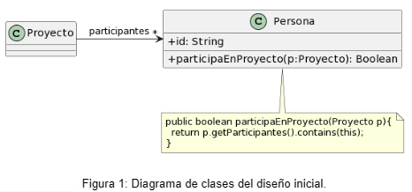
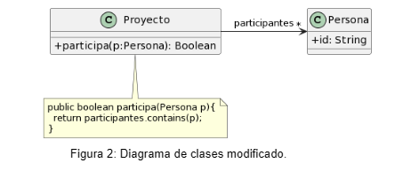

### 1.2 Participación en proyectos 
Al revisar el siguiente diseño inicial (Figura 1), se decidió realizar un cambio para evitar lo que se consideraba un mal olor. El diseño modificado se muestra en la Figura 2. Indique qué tipo de cambio se realizó y si lo considera apropiado. Justifique su respuesta

Diseño inicial:



Diseño revisado:	



- - -

### Solucion:

#### Code smells:

##### 1. Feature Envy

**problema**
La clase ```Persona``` es responsable de determinar si participa o no en un Proyecto. 
Esto significa que la clase ```Persona``` está más interesada en la clase ```Proyecto``` que en sus propios datos y comportamiento.
Pensandolo con logica tendria mas sentido que la clase ```Proyecto``` determine quienes son las Personas que participan o no en este.

**solucion**
La responsabilidad de determinar si una persona participa o no en un proyecto se paso a la clase ```Proyecto```. 
Esto es más apropiado, ya que la clase ```Proyecto``` tiene más información sobre el proyecto y los participantes, ademas de que si lo pensamos tiene mas sentido.


##### 2. Data class

**problema**
La clase ```Proyecto``` se utiliza principalmente para almacenar datos sobre el proyecto, como el nombre del proyecto, la descripción y las fechas de inicio y finalización. No tiene mucho comportamiento, aparte de almacenar y recuperar datos. 

**solucion**
La clase ```Proyecto``` ahora tiene cierto comportamiento relacionado con la gestión de las personas. Esto hace que la clase Proyecto sea más activa y menos como una clase de datos.