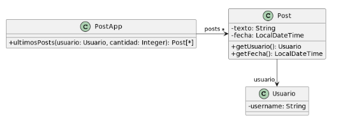

### Ejercicio 2 
Para cada una de las siguientes situaciones, realice en forma iterativa los siguientes pasos:
(i) indique el mal olor,
(ii) indique el refactoring que lo corrige, 
(iii) aplique el refactoring, mostrando el resultado final (código y/o diseño según corresponda). 
Si vuelve a encontrar un mal olor, retorne al paso (i). 

### 2.3 Publicaciones



```java
/**
* Retorna los últimos N posts que no pertenecen al usuario user
*/
public List<Post> ultimosPosts( Usuario user, int cantidad ) {
        
    List<Post> postsOtrosUsuarios = new ArrayList<Post>();
        for (Post post : this.posts) {
            if (!post.getUsuario().equals(user)) {
                postsOtrosUsuarios.add(post);
        }
    }

    // ordena los posts por fecha
    for (int i = 0; i < postsOtrosUsuarios.size(); i++) {

        int masNuevo = i;

        for( int j= i +1; j < postsOtrosUsuarios.size(); j++ ) {
            if ( postsOtrosUsuarios.get(j).getFecha().isAfter(postsOtrosUsuarios.get(masNuevo).getFecha()) ) {
                masNuevo = j;
            }    
        }

        Post unPost = postsOtrosUsuarios.set(i,postsOtrosUsuarios.get(masNuevo));
        postsOtrosUsuarios.set(masNuevo, unPost);  

    }

    List<Post> ultimosPosts = new ArrayList<Post>();
    int index = 0;
    Iterator<Post> postIterator = postsOtrosUsuarios.iterator();
    while ( postIterator.hasNext() &&  index < cantidad ) {
        ultimosPosts.add(postIterator.next());
    }
    return ultimosPosts;
}
```


<!-- 
======================================================================================================================================================================
                                                                            PASO 1
======================================================================================================================================================================
 -->

- - - 

#### PASO 1


##### (i) Detectar un Code Smell
*Code Smell Detectado **-->** "Long Method (Método Largo)*
*El metodo `ultimosPost()` es demaciado grande y tiene demaciadas responsabilidades.*
*El metodo podria concentrarse solo en devolver los ultimos N posts, pero en su lugar tambien se encarga de filtrar los posts, ordenarlos por fecha y seleccionarlos*


##### (ii) Indicar un Refactoring para Solucionar ese Code Smell
*Refactoring Sugerido **-->** Extract Method (Extraer Método)*
*Extraemos el fragmento de codigo que se encarga de filtrar los posts para crear el metodo `filtrarPostsDeOtrosUsuarios()`*
*Extraemos el fragmento de codigo que se encarga de ordenar los posts por fecha para crear el metodo `ordenarPostsPorFecha()`*
*Extraemos el fragmento de codigo que se encarga de seleccionar los ultimos posts para crear el metodo `seleccionarUltimosPosts()`*
*Compiamos los fragmentos de codigo y los ponemos en metodos con nombres acordes, luego reemplazamos el codigo repetido con las llamadas a estos nuevos metodos*


##### (iii) Aplicar el Refactoring
```java
public class PostApp {

    private List<Post> posts;

    public PostApp(List<Post> posts) {
        this.posts = posts;
    }

    public List<Post> ultimosPosts(Usuario user, int cantidad) {

        List<Post> postsOtrosUsuarios = filtrarPostsDeOtrosUsuarios(user);

        ordenarPostsPorFecha(postsOtrosUsuarios);

        return seleccionarUltimosPosts(postsOtrosUsuarios, cantidad);

    }

    private List<Post> filtrarPostsDeOtrosUsuarios(Usuario user) {
        List<Post> postsOtrosUsuarios = new ArrayList<>();
        for (Post post : this.posts) {
            if (!post.getUsuario().equals(user)) {
                postsOtrosUsuarios.add(post);
            }
        }
        return postsOtrosUsuarios;
    }

    private void ordenarPostsPorFecha(List<Post> postsOtrosUsuarios) {
        for (int i = 0; i < postsOtrosUsuarios.size(); i++) {
            int masNuevo = i;
            for( int j= i +1; j < postsOtrosUsuarios.size(); j++ ) {
                if ( postsOtrosUsuarios.get(j).getFecha().isAfter(postsOtrosUsuarios.get(masNuevo).getFecha()) ) {
                    masNuevo = j;
                }    
            }
            Post unPost = postsOtrosUsuarios.set(i,postsOtrosUsuarios.get(masNuevo));
            postsOtrosUsuarios.set(masNuevo, unPost);  
        }
    }

    private List<Post> seleccionarUltimosPosts(List<Post> postsOtrosUsuarios, int cantidad) {
        List<Post> ultimosPosts = new ArrayList<Post>();
        int index = 0;
        Iterator<Post> postIterator = postsOtrosUsuarios.iterator();
        while ( postIterator.hasNext() &&  index < cantidad ) {
            ultimosPosts.add(postIterator.next());
        }
        return ultimosPosts;
    }
}
```


<!-- 
======================================================================================================================================================================
                                                                            PASO 2
======================================================================================================================================================================
 -->

- - - 

#### PASO 2


##### (i) Detectar un Code Smell
*Code Smell Detectado --> Duplicated Code (Código Duplicado)*
*La lógica para ordenar los posts por fecha del metodo está duplicada y podría simplificarse utilizando métodos de ordenamiento más eficientes. Podemos ver que el codigo contiene 2 bucles for practicamente iguales*


##### (ii) Indicar un Refactoring para Solucionar ese Code Smell
*Refactoring Sugerido --> Substitute Algorithm (Sustituir Algoritmo)*
*Reemplazamos la lógica de ordenamiento por completo con una llamada al método de ordenación estándar*
*La lógica de ordenación ahora es mas simple usando el método sort de List con una expresión lambda.*


##### (iii) Aplicar el Refactoring
```java
public class PostApp {

    private List<Post> posts;

    public PostApp(List<Post> posts) {
        this.posts = posts;
    }

    public List<Post> ultimosPosts(Usuario user, int cantidad) {

        List<Post> postsOtrosUsuarios = filtrarPostsDeOtrosUsuarios(user);

        ordenarPostsPorFecha(postsOtrosUsuarios);

        return seleccionarUltimosPosts(postsOtrosUsuarios, cantidad);

    }

    private List<Post> filtrarPostsDeOtrosUsuarios(Usuario user) {
        List<Post> postsOtrosUsuarios = new ArrayList<>();
        for (Post post : this.posts) {
            if (!post.getUsuario().equals(user)) {
                postsOtrosUsuarios.add(post);
            }
        }
        return postsOtrosUsuarios;
    }

    private void ordenarPostsPorFecha(List<Post> posts) {
        posts.sort((post1, post2) -> post2.getFecha().compareTo(post1.getFecha()));
    }


    private List<Post> seleccionarUltimosPosts(List<Post> postsOtrosUsuarios, int cantidad) {
        List<Post> ultimosPosts = new ArrayList<Post>();
        int index = 0;
        Iterator<Post> postIterator = postsOtrosUsuarios.iterator();
        while ( postIterator.hasNext() &&  index < cantidad ) {
            ultimosPosts.add(postIterator.next());
        }
        return ultimosPosts;
    }
}
```


<!-- 
======================================================================================================================================================================
                                                                            PASO 3
======================================================================================================================================================================
 -->

- - - 

#### PASO 3


##### (i) Detectar un Code Smell
*Code Smell Detectado --> codigo complejo*
*El método `seleccionarUltimosPosts` tiene una complejidad innecesaria para hacer esta tarea, no se estan utilizando las herramientas del lenguaje como los streams().*


##### (ii) Indicar un Refactoring para Solucionar ese Code Smell
*Refactoring Sugerido --> Replace Algorithm (Reemplazar Algoritmo)*
*Podemos simplificar el método utilizando métodos de la biblioteca estándar de Java ( usamos streams ), no somos boludos*


##### (iii) Aplicar el Refactoring
```java
public class PostApp {

    private List<Post> posts;

    public PostApp(List<Post> posts) {
        this.posts = posts;
    }

    public List<Post> ultimosPosts(Usuario user, int cantidad) {
        List<Post> postsOtrosUsuarios = filtrarPostsDeOtrosUsuarios(user);
        ordenarPostsPorFecha(postsOtrosUsuarios);
        return seleccionarUltimosPosts(postsOtrosUsuarios, cantidad);
    }

    private List<Post> filtrarPostsDeOtrosUsuarios(Usuario user) {
        List<Post> postsOtrosUsuarios = new ArrayList<>();
        for (Post post : this.posts) {
            if (!post.getUsuario().equals(user)) {
                postsOtrosUsuarios.add(post);
            }
        }
        return postsOtrosUsuarios;
    }

    private void ordenarPostsPorFecha(List<Post> posts) {
        posts.sort((post1, post2) -> post2.getFecha().compareTo(post1.getFecha()));
    }


    private List<Post> seleccionarUltimosPosts(List<Post> posts, int cantidad) {
        return posts.subList(0, Math.min(cantidad, posts.size()));
    }

}
```

#### UML de la resolucion:

