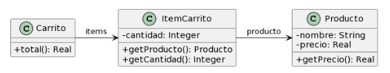
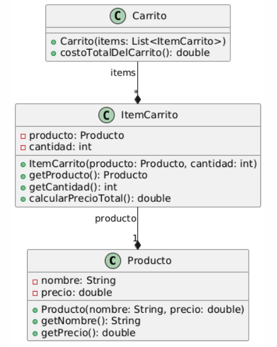

### Ejercicio 2 
Para cada una de las siguientes situaciones, realice en forma iterativa los siguientes pasos:
(i) indique el mal olor,
(ii) indique el refactoring que lo corrige, 
(iii) aplique el refactoring, mostrando el resultado final (código y/o diseño según corresponda). 
Si vuelve a encontrar un mal olor, retorne al paso (i). 

### 2.4 Carrito de compras



```java
public class Producto {

    private String nombre;
    private double precio;
    
    public double getPrecio() {
        return this.precio;
    }

}

public class ItemCarrito {

    private Producto producto;
    private int cantidad;
      
    public Producto getProducto() {
        return this.producto;
    }
    
    public int getCantidad() {
        return this.cantidad;
    }

}

public class Carrito {

    private List<ItemCarrito> items;

    public double total() {
        return this.items.stream()
            .mapToDouble(item -> item.getProducto().getPrecio() * item.getCantidad())
            .sum();
    }

}
```


<!-- 
======================================================================================================================================================================
                                                                            PASO 1
======================================================================================================================================================================
 -->

---

#### PASO 1


##### (i) Detectar un Code Smell
*Code Smell Detectado --> Feature Envy (Envidia de Funcionalidad)*
*La clase `Carrito` está haciendo los calculos del total usando la informacion de `ItemCarrito`. El calculo deberia ser delegado a la clase `ItemCarrito` y que el metodo `total()` solo se encargue de sumar los valores*


##### (ii) Indicar un Refactoring para Solucionar ese Code Smell
*Refactoring Sugerido --> Move Method (Mover Método)*
*Movemos la logica que se encarga de calcular el total de un item a la clase `ItemCarrito` en un nuevo metodo `calcularPrecioTotal()`*


##### (iii) Aplicar el Refactoring
```java
public class Producto {

    private String nombre;
    private double precio;
    
    public double getPrecio() {
        return this.precio;
    }

}

public class ItemCarrito {

    private Producto producto;
    private int cantidad;
      
    public Producto getProducto() {
        return this.producto;
    }
    
    public int getCantidad() {
        return this.cantidad;
    }

    public double calcularPrecioTotal() {
        return this.producto.getPrecio() * this.cantidad;
    }

}

public class Carrito {

    private List<ItemCarrito> items;

    public double total() {
        return this.items.stream()
            .mapToDouble(item -> item.calcularPrecioTotal() )
            .sum();
    }

}
```


<!-- 
======================================================================================================================================================================
                                                                            PASO 2
======================================================================================================================================================================
 -->

--- 

#### PASO 2


##### (i) Detectar un Code Smell
*Code Smell Detectado --> "Nombre poco descriptivo"*
*El metodo `total()` de la clase `Carrito` no refleja claramente que lo que hace es calcular el costo total del carrito*


##### (ii) Indicar un Refactoring para Solucionar ese Code Smell
*Refactoring Sugerido --> Rename Method (Renombrar Método)*
*Cambiamos el nombre del metodo para que sea mas intuitivo a `costoTotalDelCarrito`*

##### (iii) Aplicar el Refactoring
```java
public class Producto {

    private String nombre;
    private double precio;
    
    public double getPrecio() {
        return this.precio;
    }

}

public class ItemCarrito {

    private Producto producto;
    private int cantidad;
      
    public Producto getProducto() {
        return this.producto;
    }
    
    public int getCantidad() {
        return this.cantidad;
    }

    public double calcularPrecioTotal() {
        return this.producto.getPrecio() * this.cantidad;
    }

}

public class Carrito {

    private List<ItemCarrito> items;

    public double costoTotalDelCarrito() {
        return this.items.stream()
            .mapToDouble(item -> item.calcularTotal() )
            .sum();
    }

}
```


<!-- 
======================================================================================================================================================================
                                                                            PASO 3
======================================================================================================================================================================
 -->

--- 

#### PASO 3


##### (i) Detectar un Code Smell
*Code Smell Detectado --> "Ausencia de constructor"*
*Las clases `Producto` `ItemCarrito` y `Carrito` no tienen un constructores que permitan inicializar los valores de sus atributos*


##### (ii) Indicar un Refactoring para Solucionar ese Code Smell
*Refactoring Sugerido --> Agregar Constructor*
*Agregamos constructores a todas las clases*

##### (iii) Aplicar el Refactoring
```java
public class Producto {

    private String nombre;
    private double precio;

    public Producto(String nombre, double precio) {
        this.nombre = nombre;
        this.precio = precio;
    }

    public double getPrecio() {
        return this.precio;
    }

    public String getNombre() {
        return this.nombre;
    }

}

public class ItemCarrito {

    private Producto producto;
    private int cantidad;
      
    public ItemCarrito(Producto producto, int cantidad) {
        this.producto = producto;
        this.cantidad = cantidad;
    }

    public Producto getProducto() {
        return this.producto;
    }
    
    public int getCantidad() {
        return this.cantidad;
    }

    public double calcularPrecioTotal() {
        return this.producto.getPrecio() * this.cantidad;
    }

}

public class Carrito {

    private List<ItemCarrito> items;

    public Carrito(List<ItemCarrito> items) {
        this.items = new ArrayList<>(items);
    }

    public double costoTotalDelCarrito() {
        return this.items.stream()
            .mapToDouble(item -> item.calcularTotal() )
            .sum();
    }

}
```
#### UML de la resolucion:

