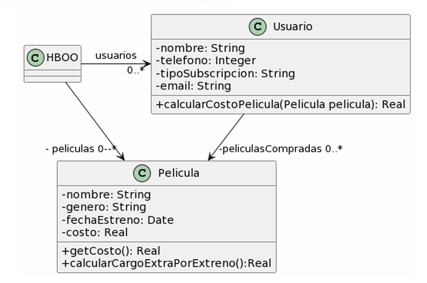
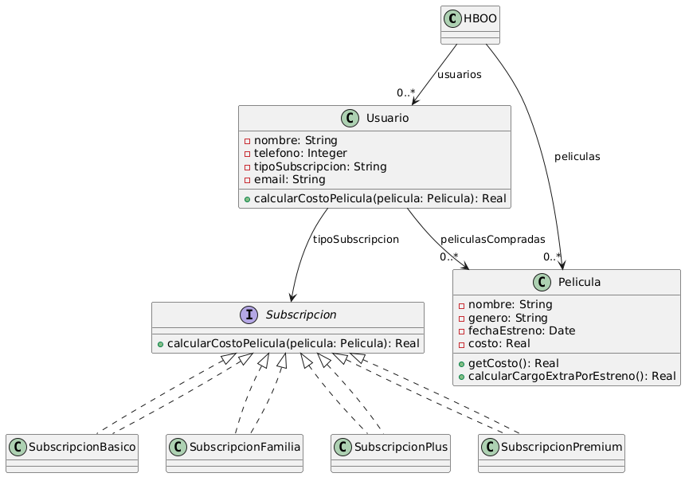

### Ejercicio 2 
Para cada una de las siguientes situaciones, realice en forma iterativa los siguientes pasos:
(i) indique el mal olor,
(ii) indique el refactoring que lo corrige, 
(iii) aplique el refactoring, mostrando el resultado final (código y/o diseño según corresponda). 
Si vuelve a encontrar un mal olor, retorne al paso (i). 

### 2.6 Películas



```java
public class Usuario {
    String tipoSubscripcion;
    // ...

    public void setTipoSubscripcion(String unTipo) {
        this.tipoSubscripcion = unTipo;
    }
    
    public double calcularCostoPelicula(Pelicula pelicula) {
        double costo = 0;
        if (tipoSubscripcion == "Basico") {
            costo = pelicula.getCosto() + pelicula.calcularCargoExtraPorEstreno();
        }
        else if (tipoSubscripcion == "Familia") {
            costo = (pelicula.getCosto() + pelicula.calcularCargoExtraPorEstreno()) * 0.90;
        }
        else if (tipoSubscripcion == "Plus") {
            costo = pelicula.getCosto();
        }
        else if (tipoSubscripcion == "Premium") {
            costo = pelicula.getCosto() * 0.75;
        }
        return costo;
    }
}

public class Pelicula {
    LocalDate fechaEstreno;
    // ...

    public double getCosto() {
        return this.costo;
    }
    
    public double calcularCargoExtraPorEstreno() {
        // Si la Película se estrenó 30 días antes de la fecha actual, retorna un cargo de 0$, caso contrario, retorna un cargo extra de 300$
        return (ChronoUnit.DAYS.between(this.fechaEstreno, LocalDate.now())) > 30 ? 0 : 300;
    }
}
```


<!-- 
======================================================================================================================================================================
                                                                            PASO 1
======================================================================================================================================================================
 -->

---

#### PASO 1


##### (i) Detectar un Code Smell
*Code Smell Detectado --> Switch Statements*
*La clase `Usuario` tiene una secuencia de if para definir el calculo del costo de una pelicula*


##### (ii) Indicar un Refactoring para Solucionar ese Code Smell
*Refactoring Sugerido --> Replace Conditional with Polymorphism*
*Primero utilizarmos `extract method` y `move method` para tomar la logica que se encarga de calcular el costo y moverla a `Subscripcion`. Luego usamos Replace Conditional with Polymorphism para reemplazar la secuencia de ifs por subclases especificas `SubscripcionBasico` `SubscripcionFamilia` `SubscripcionPlus` `SubscripcionPremium`*


##### (iii) Aplicar el Refactoring
```java
public interface Subscripcion {
    //...

    double calcularCostoPelicula(Pelicula pelicula);
}

public class SubscripcionBasico implements Subscripcion{
    public double calcularCostoPelicula(Pelicula pelicula) {
        return pelicula.getCosto() + pelicula.calcularCargoExtraPorEstreno();
    }
}

public class SubscripcionFamilia implements Subscripcion{
    public double calcularCostoPelicula(Pelicula pelicula) {
        return (pelicula.getCosto() + pelicula.calcularCargoExtraPorEstreno()) * 0.90;
    }
}

public class SubscripcionPlus implements Subscripcion{
    public double calcularCostoPelicula(Pelicula pelicula) {
        return pelicula.getCosto();
    }
}

public class SubscripcionPremium implements Subscripcion{
    public double calcularCostoPelicula(Pelicula pelicula) {
        return pelicula.getCosto() * 0.75;
    }
}

public class Usuario {
    private Subscripcion tipoSubscripcion;
    // ...

    public void setTipoSubscripcion(String unTipo) {
        this.tipoSubscripcion = unTipo;
    }
    
    public double calcularCostoPelicula(Pelicula pelicula) {
        return this.tipoSubscripcion.calcularCostoPelicula(pelicula);
    }

}

public class Pelicula {
    LocalDate fechaEstreno;
    // ...

    public double getCosto() {
        return this.costo;
    }
    
    public double calcularCargoExtraPorEstreno() {
        // Si la Película se estrenó 30 días antes de la fecha actual, retorna un cargo de 0$, caso contrario, retorna un cargo extra de 300$
        return (ChronoUnit.DAYS.between(this.fechaEstreno, LocalDate.now())) > 30 ? 0 : 300;
    }
}
```


<!-- 
======================================================================================================================================================================
                                                                            PASO 2
======================================================================================================================================================================
 -->

---

#### PASO 2


##### (i) Detectar un Code Smell
*Code Smell Detectado --> Comments*
*El metodo `calcularCargoExtraPorEstreno` tiene un comentario larguisimo que explica la funcionalidad*


##### (ii) Indicar un Refactoring para Solucionar ese Code Smell
*Refactoring Sugerido --> Eliminar comentario*
*Se entiende, no?*


##### (iii) Aplicar el Refactoring
```java
public interface Subscripcion {
    //...

    double calcularCostoPelicula(Pelicula pelicula);
}

public class SubscripcionBasico implements Subscripcion{
    public double calcularCostoPelicula(Pelicula pelicula) {
        return pelicula.getCosto() + pelicula.calcularCargoExtraPorEstreno();
    }
}

public class SubscripcionFamilia implements Subscripcion{
    public double calcularCostoPelicula(Pelicula pelicula) {
        return (pelicula.getCosto() + pelicula.calcularCargoExtraPorEstreno()) * 0.90;
    }
}

public class SubscripcionPlus implements Subscripcion{
    public double calcularCostoPelicula(Pelicula pelicula) {
        return pelicula.getCosto();
    }
}

public class SubscripcionPremium implements Subscripcion{
    public double calcularCostoPelicula(Pelicula pelicula) {
        return pelicula.getCosto() * 0.75;
    }
}

public class Usuario {
    private Subscripcion tipoSubscripcion;
    // ...

    public void setTipoSubscripcion(String unTipo) {
        this.tipoSubscripcion = unTipo;
    }
    
    public double calcularCostoPelicula(Pelicula pelicula) {
        return this.tipoSubscripcion.calcularCostoPelicula(pelicula);
    }

}

public class Pelicula {
    LocalDate fechaEstreno;
    // ...

    public double getCosto() {
        return this.costo;
    }
    
    public double calcularCargoExtraPorEstreno() {
        return (ChronoUnit.DAYS.between(this.fechaEstreno, LocalDate.now())) > 30 ? 0 : 300;
    }
}
```


