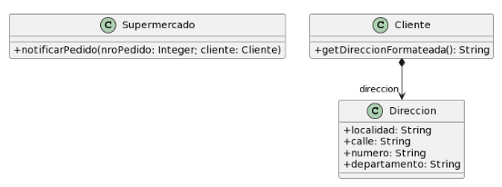

### Ejercicio 2 
Para cada una de las siguientes situaciones, realice en forma iterativa los siguientes pasos:
(i) indique el mal olor,
(ii) indique el refactoring que lo corrige, 
(iii) aplique el refactoring, mostrando el resultado final (código y/o diseño según corresponda). 
Si vuelve a encontrar un mal olor, retorne al paso (i). 

### 2.5 Envío de pedidos



```java
public class Supermercado {

    public void notificarPedido(long nroPedido, Cliente cliente) {
            
        String notificacion = MessageFormat.format(“Estimado cliente, se le informa que hemos recibido su pedido con número {0}, el cual será enviado a la dirección {1}”, new Object[] { nroPedido, cliente.getDireccionFormateada() });

        // lo imprimimos en pantalla, podría ser un mail, SMS, etc..
        System.out.println(notificacion);
    }
}

public class Cliente {

    public String getDireccionFormateada() {
    
    return  this.direccion.getLocalidad() + “, ” +
            this.direccion.getCalle() + “, ” +
            this.direccion.getNumero() + “, ” +
            this.direccion.getDepartamento();

}
```