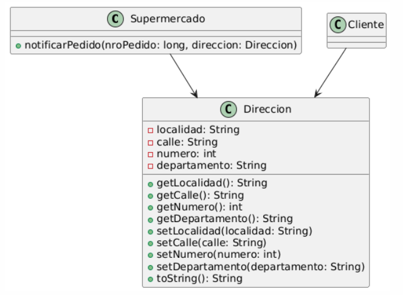

### Ejercicio 2 
Para cada una de las siguientes situaciones, realice en forma iterativa los siguientes pasos:
(i) indique el mal olor,
(ii) indique el refactoring que lo corrige, 
(iii) aplique el refactoring, mostrando el resultado final (código y/o diseño según corresponda). 
Si vuelve a encontrar un mal olor, retorne al paso (i). 

### 2.5 Envío de pedidos


```java
public class Supermercado {

    public void notificarPedido(long nroPedido, Cliente cliente) {
            
        String notificacion = MessageFormat.format("Estimado cliente, se le informa que hemos recibido su pedido con número {0}, el cual será enviado a la dirección {1}", new Object[] { nroPedido, cliente.getDireccionFormateada() });

        // lo imprimimos en pantalla, podría ser un mail, SMS, etc..
        System.out.println(notificacion);
    }
}

public class Cliente {

    public String getDireccionFormateada() {

        return  this.direccion.getLocalidad() + “, ” +
                this.direccion.getCalle() + “, ” +
                this.direccion.getNumero() + “, ” +
                this.direccion.getDepartamento();
    }
}
```


<!-- 
======================================================================================================================================================================
                                                                            PASO 1
======================================================================================================================================================================
 -->

---

#### PASO 1


##### (i) Detectar un Code Smell
*Code Smell Detectado --> Feature Envy*
*La clase `Cliente` está accediendo a los atributos de `direccion` y realizando la tarea de formatearla*


##### (ii) Indicar un Refactoring para Solucionar ese Code Smell
*Refactoring Sugerido --> Move Method*
*Movemos la logica que se encarga de formatear la dirección a la clase `Direccion` para que se formatee a si misma ( asumo que ya existe la clase dirección, sinó de donde salio el `this.direccion.getLocalidad()` de arriba ???? )*


##### (iii) Aplicar el Refactoring
```java
public class Supermercado {

    public void notificarPedido(long nroPedido, Cliente cliente) {
            
        String notificacion = MessageFormat.format("Estimado cliente, se le informa que hemos recibido su pedido con número {0}, el cual será enviado a la dirección {1}", new Object[] { nroPedido, cliente.getDireccionFormateada() });

        // lo imprimimos en pantalla, podría ser un mail, SMS, etc..
        System.out.println(notificacion);
    }
}

public class Cliente {

    public String getDireccionFormateada() {        
        return  this.direccion.toString();
    }
}

public class Direccion {

    private String localidad;
    private String calle;
    private int numero;
    private String departamento;

    public String getLocalidad() {
        return localidad;
    }

    public String getCalle() {
        return calle;
    }

    public int getNumero() {
        return numero;
    }

    public String getDepartamento() {
        return departamento;
    }

    public void setLocalidad(String localidad) {
        this.localidad = localidad;
    }

    public void setCalle(String calle) {
        this.calle = calle;
    }

    public void setNumero(int numero) {
        this.numero = numero;
    }

    public void setDepartamento(String departamento) {
        this.departamento = departamento;
    }

    public String toString() {
        return this.localidad + ", " +
               this.calle  + ", " +
               this.numero + ", " +
               this.departamento;
    }

}
```


<!-- 
======================================================================================================================================================================
                                                                            PASO 2
======================================================================================================================================================================
 -->

---

#### PASO 2


##### (i) Detectar un Code Smell
*Code Smell Detectado --> Middle Man*
*La clase `Cliente` solo realiza una acción, delegar tareas a la clase dirección, por lo que unicamente está para hacer de intermediario entre `Supermercado` y `Dirección`*


##### (ii) Indicar un Refactoring para Solucionar ese Code Smell
*Refactoring Sugerido --> Remove Middle Man*
*Eliminamos el método de la clase `Cliente` y hacemos que el metodo `notificarPedido`, que se encuentra en la clase `Supermercado` llame directamente a el `toString()` de `Direccion`*


##### (iii) Aplicar el Refactoring
```java
public class Supermercado {

    public void notificarPedido(long nroPedido, Direccion direccion) {
            
        String notificacion = MessageFormat.format("Estimado cliente, se le informa que hemos recibido su pedido con número {0}, el cual será enviado a la dirección {1}", new Object[] { nroPedido, direccion.toString() });

        // lo imprimimos en pantalla, podría ser un mail, SMS, etc..
        System.out.println(notificacion);
    }
}

public class Direccion {

    private String localidad;
    private String calle;
    private int numero;
    private String departamento;

    public String getLocalidad() {
        return localidad;
    }

    public String getCalle() {
        return calle;
    }

    public int getNumero() {
        return numero;
    }

    public String getDepartamento() {
        return departamento;
    }

    public void setLocalidad(String localidad) {
        this.localidad = localidad;
    }

    public void setCalle(String calle) {
        this.calle = calle;
    }

    public void setNumero(int numero) {
        this.numero = numero;
    }

    public void setDepartamento(String departamento) {
        this.departamento = departamento;
    }

    public String toString() {
        return this.localidad + ", " +
               this.calle  + ", " +
               this.numero + ", " +
               this.departamento;
    }

}
```

