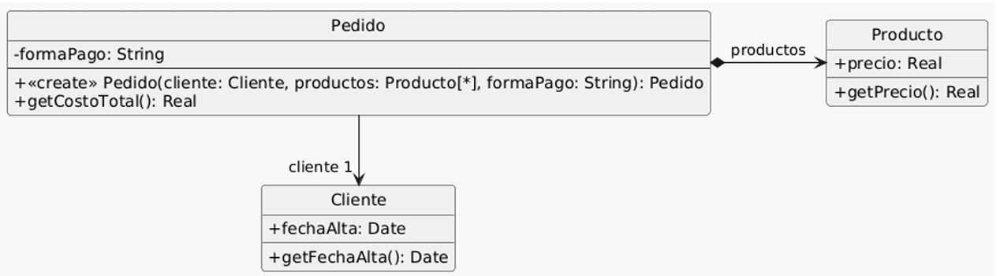

### Ejercicio 4
Se tiene el siguiente modelo de un sistema de pedidos y la correspondiente 
implementación: 



```java
01:  public class Pedido {
02:      private Cliente cliente;
03:      private List<Producto> productos;
04:      private String formaPago;
05:      public Pedido(Cliente cliente, List<Producto> productos, String formaPago) {
06:          if (!"efectivo".equals(formaPago)
07:                  && !"6 cuotas".equals(formaPago)
08:                  && !"12 cuotas".equals(formaPago)) {
09:              throw new Error("Forma de pago incorrecta");
10:          }
11:          this.cliente = cliente;
12:          this.productos = productos;
13:          this.formaPago = formaPago;
14:      }
15:      public double getCostoTotal() {
16:          double costoProductos = 0;
17:          for (Producto producto : this.productos) {
18:              costoProductos += producto.getPrecio();
19:          }
20:          double extraFormaPago = 0;
21:          if ("efectivo".equals(this.formaPago)) {
22:              extraFormaPago = 0;
23:          } else if ("6 cuotas".equals(this.formaPago)) {
24:              extraFormaPago = costoProductos * 0.2;
25:          } else if ("12 cuotas".equals(this.formaPago)) {
26:              extraFormaPago = costoProductos * 0.5;
27:          }
28:          int añosDesdeFechaAlta = Period.between(this.cliente.getFechaAlta(), LocalDate.now()).getYears();
29:          // Aplicar descuento del 10% si el cliente tiene más de 5 años de antiguedad
30:          if (añosDesdeFechaAlta > 5) {
31:              return (costoProductos + extraFormaPago) * 0.9;
32:          }
33:          return costoProductos + extraFormaPago;
34:      }
35:  }
36:  public class Cliente {
37:      private LocalDate fechaAlta;
38:      public LocalDate getFechaAlta() {
39:          return this.fechaAlta;
40:      }
41:  }
42:  public class Producto {
43:      private double precio;
44:      public double getPrecio() {
45:          return this.precio;
46:      }
47:  }
```

Tareas: 
1. Dado el código anterior, aplique únicamente los siguientes refactoring: 
● Replace Loop with Pipeline (líneas 16 a 19) 
● Replace Conditional with Polymorphism (líneas 21 a 27) 
● Extract method y move method (línea 28) 
● Extract method y replace temp with query (líneas 28 a 33) 
2. Realice el diagrama de clases del código refactorizado. 


<!-- 
======================================================================================================================================================================
                                                                        líneas 16 a 19
======================================================================================================================================================================
 -->

---

#### líneas 16 a 19: aplicamos "Replace Loop with Pipeline"

- Antes

```java
public class Pedido {
    private Cliente cliente;
    private List<Producto> productos;
    private String formaPago;

    public Pedido(Cliente cliente, List<Producto> productos, String formaPago) {
        if (!"efectivo".equals(formaPago)
                && !"6 cuotas".equals(formaPago)
                && !"12 cuotas".equals(formaPago)) {
            throw new Error("Forma de pago incorrecta");
        }
        this.cliente = cliente;
        this.productos = productos;
        this.formaPago = formaPago;
    }

    public double getCostoTotal() {
        double costoProductos = 0;
        for (Producto producto : this.productos) {
            costoProductos += producto.getPrecio();
        }
```

- Después

```java
public class Pedido {
    private Cliente cliente;
    private List<Producto> productos;
    private String formaPago;

    public Pedido(Cliente cliente, List<Producto> productos, String formaPago) {
        if (!"efectivo".equals(formaPago)
                && !"6 cuotas".equals(formaPago)
                && !"12 cuotas".equals(formaPago)) {
            throw new Error("Forma de pago incorrecta");
        }
        this.cliente = cliente;
        this.productos = productos;
        this.formaPago = formaPago;
    }

    public double getCostoTotal() {
        double costoProductos = this.productos.stream()
                .mapToDouble(Producto::getPrecio)
                .sum();
```


<!-- 
======================================================================================================================================================================
                                                                        líneas 21 a 27
======================================================================================================================================================================
 -->

---

#### líneas 21 a 27: aplicamos "Conditional with Polymorphism"

- Antes

```java
double extraFormaPago = 0;
if ("efectivo".equals(this.formaPago)) {
    extraFormaPago = 0;
} else if ("6 cuotas".equals(this.formaPago)) {
    extraFormaPago = costoProductos * 0.2;
} else if ("12 cuotas".equals(this.formaPago)) {
    extraFormaPago = costoProductos * 0.5;
}
```

- Después

```java
public interface FormaPago {
    double calcularRecargo(double costoProductos);
}
```
```java
public class Efectivo implements FormaPago {
    public double calcularRecargo(double costoProductos) {
        return 0;
    }
}

public class SeisCuotas implements FormaPago {
    public double calcularRecargo(double costoProductos) {
        return costoProductos * 0.2;
    }
}

public class DoceCuotas implements FormaPago {
    public double calcularRecargo(double costoProductos) {
        return costoProductos * 0.5;
    }
}
```
```java
public class Pedido {
    // ...
    private FormaPago formaPago;

    public Pedido(Cliente cliente, List<Producto> productos, FormaPagoStrategy formaPago) {
        // ...
        this.formaPago = formaPago;
    }

    public double getCostoTotal() {
        // ...

        double extraFormaPago = this.formaPago.calcularRecargo(costoProductos);

```


<!-- 
======================================================================================================================================================================
                                                                            líneas 28
======================================================================================================================================================================
 -->

---

#### línea 28: aplicamos "Extract method y Move method"

- Antes

```java
int añosDesdeFechaAlta = Period.between(this.cliente.getFechaAlta(), LocalDate.now()).getYears();
```

- Después

```java
/* En la clase Cliente */
public int getAniosDeAntiguedad() {
    return Period.between(this.fechaAlta, LocalDate.now()).getYears();
}

```
```java
/* En la clase Pedido */
int añosDesdeFechaAlta = this.cliente.getAniosDeAntiguedad();
```


<!-- 
======================================================================================================================================================================
                                                                        líneas 28 a 33
======================================================================================================================================================================
 -->

---

#### línea 28 a 33: aplicamos "Extract method y replace temp with query"

- Antes

```java
int añosDesdeFechaAlta = Period.between(this.cliente.getFechaAlta(), LocalDate.now()).getYears();
// Aplicar descuento del 10% si el cliente tiene más de 5 años de antiguedad
if (añosDesdeFechaAlta > 5) {
    return (costoProductos + extraFormaPago) * 0.9;
}
return costoProductos + extraFormaPago;
```

- Después

```java
/* En la clase Cliente */
public int getAniosDeAntiguedad() {
    return Period.between(this.fechaAlta, LocalDate.now()).getYears();
}

public boolean tieneDescuentoPorAntiguedad() {
    return this.getAniosDeAntiguedad() > 5;
}

```
```java
/* En la clase Pedido */
return this.cliente.tieneDescuentoPorAntiguedad()
    ? (costoProductos + extraFormaPago) * 0.9
    : costoProductos + extraFormaPago;
```

<!-- 
======================================================================================================================================================================
                                                                            CODIGO FINAL
======================================================================================================================================================================
 -->

---

### CÓDIGO FINAL

```java
public class Pedido {
    private Cliente cliente;
    private List<Producto> productos;
    private FormaPago formaPago;

    public Pedido(Cliente cliente, List<Producto> productos, FormaPago formaPago) {
        this.cliente = cliente;
        this.productos = productos;
        this.formaPago = formaPago;
    }

    public double getCostoTotal() {
        double costoProductos = this.productos.stream()
                .mapToDouble(Producto::getPrecio)
                .sum();

        double extraFormaPago = this.formaPago.calcularRecargo(costoProductos);

        return this.cliente.tieneDescuentoPorAntiguedad()
                ? (costoProductos + extraFormaPago) * 0.9
                : costoProductos + extraFormaPago;
    }
}
```
```java
public class Cliente {
    private LocalDate fechaAlta;

    public LocalDate getFechaAlta() {
        return this.fechaAlta;
    }

    public int getAniosDeAntiguedad() {
        return Period.between(this.fechaAlta, LocalDate.now()).getYears();
    }

    public boolean tieneDescuentoPorAntiguedad() {
        return this.getAniosDeAntiguedad() > 5;
    }
}
```
```java
public class Producto {
    private double precio;

    public double getPrecio() {
        return this.precio;
    }
}
```
```java
public interface FormaPago {
    double calcularRecargo(double costoProductos);
}

public class Efectivo implements FormaPago {
    public double calcularRecargo(double costoProductos) {
        return 0;
    }
}

public class SeisCuotas implements FormaPago {
    public double calcularRecargo(double costoProductos) {
        return costoProductos * 0.2;
    }
}

public class DoceCuotas implements FormaPago {
    public double calcularRecargo(double costoProductos) {
        return costoProductos * 0.5;
    }
}
```